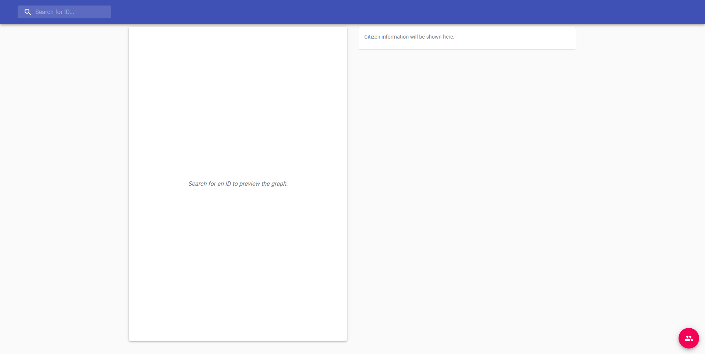
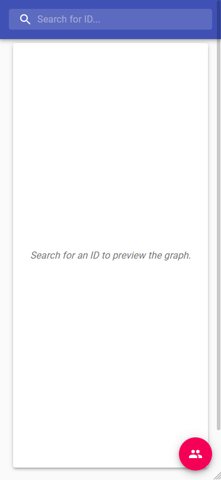
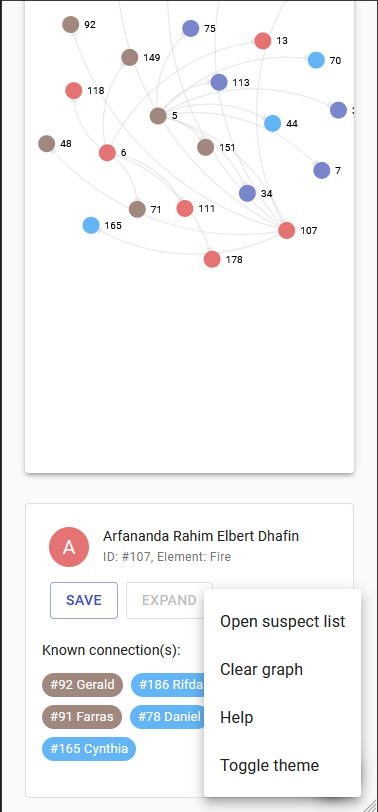

# Beifong-Wangky Suspect Expander &middot; 

> A cooperation between Republic City Police Department (Toph Beifong) and Wangky Chocolate Factory (Willy Wangky).

**Created by: Matthew Kevin Amadeus - 13518035**

## Application Background

This application was made by request from the Republic City Police Department and Willy Wangky himself. This application was made to solve the always increasing crime rate in Republic City, hence may be used later on to find the culprit behind all the mess that he/she had created open Republic City. Toph believed that using this modern app technology, Republic City can be safe from imminent threats.

## Running This Application

After cloning/downloading this repository, you must first run:

```
yarn install
```

or

```
npm install
```

This will ensure that you have all the packages needed for this project.

After all the dependencies has finished downloaded, in your project directory you can run:

```
yarn start
```

or

```
npm start
```

This will the app in the development mode.
Open [http://localhost:3000](http://localhost:3000) to view it in the browser.

Wangky said that it was to confusing for his little chocolate brain. But don't fret, I have prepared an online version hosted in [this link](https://suspect-expander.web.app). :)

## Using This Application

When you are ready to use the application, you will be greeted with a simple Material Design interface:





- Enter a valid ID into the search bar, then press `ENTER`. A graph will be shown.
- There are several things that you can do, such as clicking on a node to expand it, or by clicking the "Expand" button on the citizen information panel.
- You can add a citizen into your suspect list to keep track which citizen you suspect.
- Citizen who has been added to the suspect list can be shown in the form of graph for better viewing experience. **Note that you can't expand a suspect who is already connected to another suspect to prevent confusion. To go back to the original behavior, clear the graph first.**
- Additionaly, there is a dark mode for ~~blind people~~ night owls!
- This application also supports different screen sizes!

## Library Used

Without these libraries, this project can't be done as a whole:

- React, bootstrapped with CRA (Create React App).
- Material UI, a React material design based component library.
- [Axios](https://github.com/axios/axios), for the implementation of a promise based HTTP requests.
- react-d3-graph, a react component for showing a graph using d3.js by GitHub user [danielcaldas](https://github.com/danielcaldas/).

## API Fetching

When the application loads, the application will first clear all local storage. After that, when the user gives a query of a valid citizen ID, there are several things that are going to happen:

1. The application will check if a citizen data is available in the local storage. If yes, use the cached data from the local storage. If not, continue to step 2.
2. The application will make a `GET` request to the endpoint given.
3. The response will be stored in the local storage.

This way, it minimizes the use of internet connection. Republic City's internet connection is _very_ unstable, so this will suit perfectly.

## API Review

Wangky provided me with an API for the application to use. There are several bugs on the API that is fixed in this application, such as:

- Several citizen has some duplicated friend entry, e.g citizen with ID 5. Solving this issue can be done easily in both backend and frontend, but it is preferable to fix this problem on the backend side, as it will make unecessary duplicate-removal codes on the front end side.

```json
{
    "status": 200,
    "payload": {
        "id": "5",
        "name": "Byan Ravid",
        "friends": [
            {
                "id": "70",
                "name": "Raihan Yumna Daniel",
                "element": "water"
            },
            {
                "id": "70",
                "name": "Raihan Yumna Daniel",
                "element": "water"
            },
            ...
        ],
        "element": "earth"
    },
    "message": ""
}
```

- Several citizen has a listed connection with themselves, which doesn't really make sense, e.g citizen with ID 85. Again, this problem is bettr solved on the backend side.

```json
{
  "status": 200,
  "payload": {
    "id": "85",
    "name": "Ho Kelana Grace",
    "friends": [
      ...
      {
        "id": "85",
        "name": "Ho Kelana Grace",
        "element": "earth"
      },
      ...
    ],
    "element": "earth"
  },
  "message": ""
}
```

- Useless `status` field in the response, as the response status code can be get from the response header. In most cases, status codes are just for filtering the "good" and "bad" responses using `.then()` and `.catch()`.

```json
{
  "status": 200,
  "payload": {...},
  "message": ""
}
```

## Documentation

If for what ever reason you want to reuse this project or improve it by yourself, I have provided the documentation generated using `tsdoc`. It can be found in the `docs` folder. Before modifying, **please ask Toph/Wangky's permission first!**
